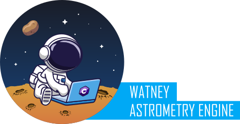

# Watney Astrometry Engine

[](https://github.com/Jusas/WatneyAstrometry/wiki) 
[](https://www.nuget.org/packages/WatneyAstrometry.Core/) 



# Introduction

The Watney Astrometry Engine (hereafter Watney or WatneyAstrometry) is an astrometric solver as a .NET/C# library. It was built mainly for amateur astrophotography. Its implementation is based on the same basic algorithm that Han Kleijn's ASTAP implemented (and is [described in more detail here](http://www.hnsky.org/astap_astrometric_solving.htm). While the solving algorithm uses the same principles, that is probably where the similarities end. 

The solver was designed from the beginning as a library with no dependencies. It is implemented as a .NET Standard 2.0 library and published as a Nuget package. The netstandard 2.0 profile provides compatibility with both .NET Framework and .NET Core 2.0 and later as well as .NET 6. This way if anyone wants to embed Watney to their .NET based apps, very little effort is required.

Alongside the solver library two apps are provided for plate solving:
- CLI Solver App (watney-solve) is provided for basic plate solving via command line. The CLI app has released binaries for Windows x64, Linux x64, arm and arm64 and Mac OSX x64.
- API Solver App (watney-api) if provided for plate solving via REST API. The API also contains Astrometry.net compatibility API, allowing it to be used as a substitute to nova.astrometry.net online solver.

See Watney in action: **https://watney-astrometry.net**

# Downloads

- watney-solve (CLI solver): **[See the Releases page for downloads](https://github.com/Jusas/WatneyAstrometry/releases)** and **[Quickstart Guide here](https://github.com/Jusas/WatneyAstrometry/wiki/Quickstart-Guide)**
- watney-api (API solver): **[See the Releases page for downloads](https://github.com/Jusas/WatneyAstrometry/releases)** and **[Quickstart Guide here](https://github.com/Jusas/WatneyAstrometry/wiki/API-Quickstart-Guide)**
- WatneyAstrometry.Core Nuget: https://www.nuget.org/packages/WatneyAstrometry.Core
- WatneyAstrometry.ImageReaders Nuget: https://www.nuget.org/packages/WatneyAstrometry.ImageReaders

# The Sources

Most of the documentation will be written [into the Wiki](https://github.com/Jusas/WatneyAstrometry/wiki), so head over there if you need to know how this all works. Here's the rundown on the sources:

| Directory | Description |
|-----------|-------------|
| WatneyAstrometry.Core | The core library project. This project contains the algorithms and the solver implementation code. |
| WatneyAstrometry.Core.Tests | Unit tests for the library. Contains both solving tests and some visual debugging aids. |
| WatneyAstrometry.GaiaStarExtractor | A star extractor that reads Gaia2 catalog files (*.csv.gz) and extracts the minimum required data set from them for further processing. |
| WatneyAstrometry.GaiaQuadDatabaseCreator | The program that builds the star quad database files for the solver to use, from the star extractor's stars. |
| WatneyAstrometry.ImageReaders | Image readers as a library, providing support for reading common image formats. |
| WatneyAstrometry.ImageReaders.Tests | Unit tests for the image readers. |
| WatneyAstrometry.SolverApp | The CLI app that provides a basic command line interface for solving images. |
| WatneyAstrometry.WebApi | The API app that provides REST interface to the solver. |

# Examples

A minimal example of usage of WatneyAstrometry.Core:

```CS
DefaultFitsReader r = new DefaultFitsReader();
var img = r.FromFile("m31.fits");

// Just for show; use the image's already present coordinates with a bit of an offset.
var nearCenter = new EquatorialCoords(img.Metadata.CenterPos.Ra + 0.1, img.Metadata.CenterPos.Dec + 5);
var nearbyStrategy = new NearbySearchStrategy(nearCenter, new NearbySearchStrategy.Options()
{
    ScopeFieldRadius = 2,
    SearchAreaRadius = 10,
    MaxNegativeDensityOffset = 2,
    MaxPositiveDensityOffset = 2
});

var quadDb = new CompactQuadDatabase()
    .UseDataSource(_quadDbPath);
var solver = new Solver()
    .UseQuadDatabase(quadDb);

var token = CancellationToken.None;
var solveResult = await solver.SolveFieldAsync(img, nearbyStrategy, token);

if (solveResult.Success)
{
    Console.WriteLine(solveResult.Solution.PlateCenter);
}
```


# Why is it called Watney?

When I first started this project, I had no idea what to call it. I was intrigued by the mechanics of plate solving and I figured out it was something that wasn't really too complicated in the end, so I started the journey. Little did I know the amount of tinkering, maths, trial and error and optimization was involved. I'm a software engineer and not an astronomer (merely an aspiring astrophotographer), so I did need to learn to "science the shit out of it" like the fictitious astronaut [Mark Watney](https://the-martian.fandom.com/wiki/Mark_Watney/Film). Also in many instances "good enough, it works" approach was taken. So while this implementation might not account for star movement, or account for all edge cases, it's still meant to be good enough for what it was built for: plate solving for every day astrophotography.

So, Watney. 

## Is that a potato or Deimos in the logo?

Yes.
